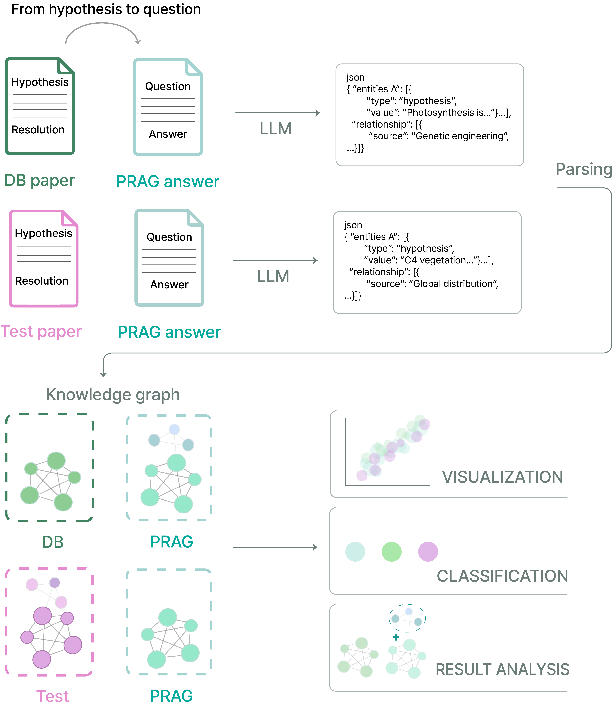

# PRAG-visualization
Automated PDF parsing and GPT-based knowledge graph construction for visualizing photosynthesis research texts.
The workflow is broken down into the following steps:

1. **Research Paper Evaluation**  
   - Automatic PDF text extraction and scoring of scientific depth and domain coverage using OpenAI’s API.  
2. **Entity & Relationship Extraction**  
   - Automated parsing of PDFs to identify entities and relationships (via GPT-based NLP techniques) and classify them according to spatial and temporal scales.  
3. **Knowledge Graph Visualization**  
   - Interactive web application (using Dash & Cytoscape) to visualize nodes and edges derived from the extracted entities and relationships.

## Table of Contents
- [Features](#features)
- [Installation](#installation)
- [Usage](#usage)
  - [1. Research Paper Evaluation ([paper_evaluation.py](./paper_evaluation.py))]
  - [2. Entity & Relationship Extraction ([entity_extraction.py](./entity_extraction.py))]
  - [3. Knowledge Graph Visualization ([KG_visualization.py](./KG_visualization.py))]

---

## Features

### Automated PDF Parsing
Uses libraries like **PyPDF2** or **PyMuPDF (fitz)** to automatically extract text from research papers. This step is the starting point for further processing and makes it easier to handle a large collection of scientific papers.

### LLM-Based Scientific Text Evaluation
Uses OpenAI’s **ChatCompletion API** to evaluate unstructured scientific text (from LLM outputs or research papers) based on two main factors: **scientific depth** and **domain coverage**. This helps researchers quickly see how detailed or wide-ranging a text is, so they can compare the academic level of different discussion sections, hypotheses, or entire papers.


### Entity & Relationship Extraction
Finds the key ideas (**entities**) and how they connect (**relationships**) in large amounts of text from LLM outputs and research papers. By automatically identifying important concepts and the ways they link together, this process reduces information overload for researchers and keeps only the most useful details for visualization.



### Spatial/Temporal Classification
Photosynthesis research covers many scales—from quick molecular interactions to changes that happen over centuries, and from tiny structures to large environmental systems. By mapping the extracted entities (and sometimes relationships) onto different **time** (immediate, short-term, long-term, etc.) and **space** (molecular, cellular, ecosystem, etc.) scales, researchers can quickly tell the “level” at which a paper or LLM discussion focuses.

### Interactive Knowledge Graph Visualization
Uses a **Dash** web application (with **Cytoscape**) to show the extracted entities and relationships from both LLM outputs and research papers as an interactive graph. This lets researchers:
1. Compare how different papers or LLM discussions handle the same hypothesis.  
2. Adjust node sizes, colors, and other styles to highlight important topics.  
3. Export the entire graph as a PNG for easy sharing or presentation.

---

## Installation
Make sure you have [Python 3.7+](https://www.python.org/) installed. Then install the required libraries:

```bash
pip install openai PyPDF2 PyMuPDF dash dash-cytoscape dash-daq
